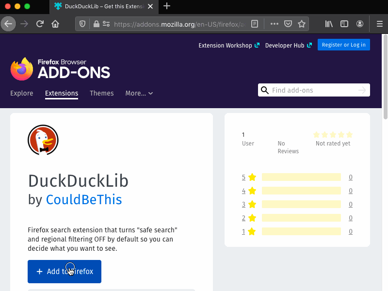
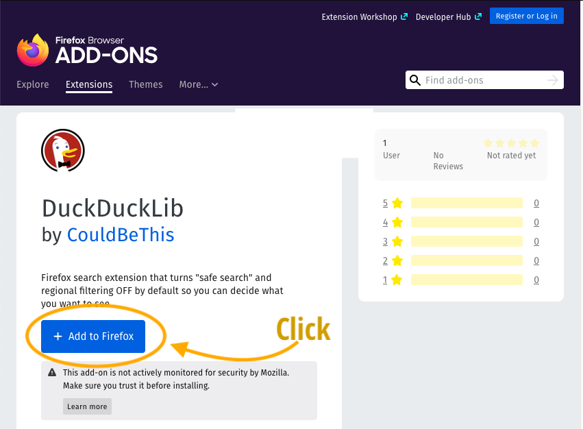
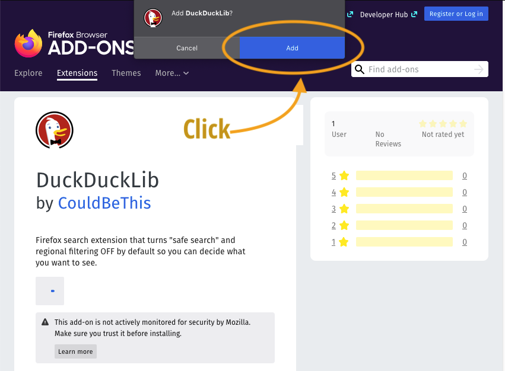
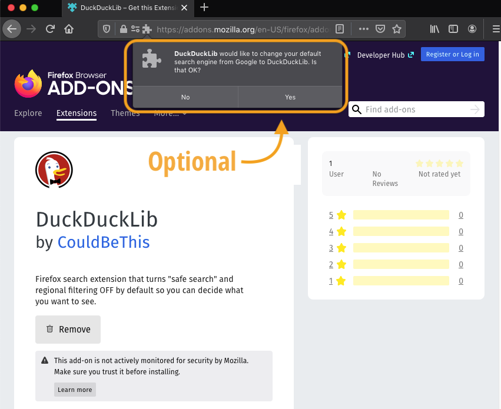
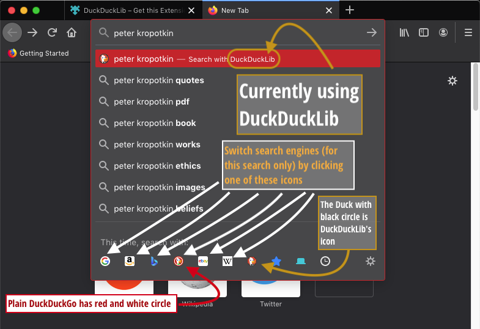
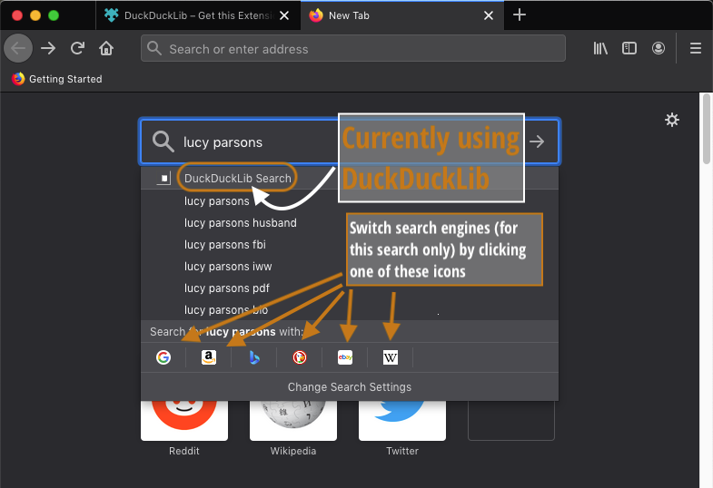
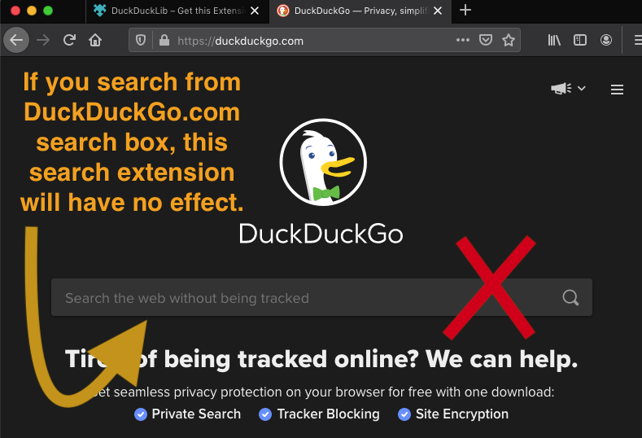

---
<!-=
title: Instructions
description: How to install, use and uninstalled DuckDuckLib Firefox extension.
authors:
	- CouldBeThis
date: 2021-03-15
# use for root-level document:
typora-copy-images-to: /images
# use for 2ndary level document:
#typora-copy-images-to: ../images
-->
---

## Instructions

### Requirements

This extension only works on Firefox for Desktop (includes laptops!). Firefox web browser is a great option for most people. 

[Download Firefox.](https://www.mozilla.org/en-US/firefox/new/) 

Once you have Firefox installed, make sure to [keep it updated](https://support.mozilla.org/en-US/kb/update-firefox-latest-release).

### Install extension (quick)

<figure>
  </a>
  <figcaption>screencapture animation showing the steps to install DuckDuckLib as firefox extension, which are enumerated below</figcaption>
</figure>
1. Visit the [extension's web page](https://addons.mozilla.org/en-US/firefox/addon/duckducklib/) with Firefox.
2. Click "Add to Firefox", accept the confirmation dialogue and decide if you want it in private windows.
3. Accept or decline setting DuckDuckLib as your default search engine. 
4. Done!

### Install instructions (detailed)

1. Visit the [extension's web page](https://addons.mozilla.org/en-US/firefox/addon/duckducklib/) with Firefox.
2. Click "Add to Firefox"

3. A confirmation box appears to make sure you want to add the extension.  Click "Add".

4. A confirmation box appears asking if you want to make DuckDuck Lib the default search engine. This is *optional*. 
   - **If you select "No"**: You will need to manually activate the plugin when you wish to use it. [Read about how to change search engines on-the-fly](https://support.mozilla.org/en-US/kb/change-your-default-search-settings-firefox#w_one-click-search-alternatives) on the Firefox website. You default search tool will remain unchanged.
   - **If you select "Yes"**: (recommended!): Every time you use the location or search bar, you will automatically use unfiltered DuckDuckGo.

5. A confirmation box appears asking if you want to enable the DuckDuckLib plugin to work in Private browsing.

   - Whether you allow this or not depends on how often and for what reasons you use Private browsing. Because this particular extension is so small and does very little, there is no real reason  *not* to allow this. However, if you would prefer to stay cautious dispensing this permission, the extension will work just fine in normal browsing.

   - [Read about why Firefox asks for specific permission](https://support.mozilla.org/en-US/kb/extensions-private-browsing) to enable this.
   - You may be interested to read about "Private" browsing (known as "incognito" in Google Chrome) in general at [wikipedia](https://en.wikipedia.org/wiki/Private_browsing)  and for [Firefox specifically](https://support.mozilla.org/en-US/kb/private-browsing-use-firefox-without-history). Private browsing does *not* protect web activity from being discovered by others as well as you may think! 

6. That's it, the extension is now installed!

## Using DuckDuckLib search extension

### Method 1: Through the Location bar

This extension will take effect when you do a websearch *through the browser*.

In Firefox, the default way to do this is by typing into the location bar near the top of the window.  The following illustration shows how to enter search terms, how to see which engine is active, and how to change engines for one search only. 

-

### Method 1 (b): Through the search bar

By default, Firefox browser combines the Location and Search bar into one box. However, it is possible to [change this](https://support.mozilla.org/en-US/kb/change-your-default-search-settings-firefox#w_search-bar) to get two separate boxes. In that case, DuckDuckLib will work via the search box. 

### Method 2: In the New Tab search box

DuckDuckLib will be effective via the new tab (blank page). By default, a new page or tab should look a bit like the below. 

1. Type in the box (with blue border), to the left of the magnifying glass
2. When you have entered you search term, press Enter or Return on your keyboard, or press the → arrow to proceed with search.

The following illustration shows how to enter search terms, how to see which engine is active, and how to change engines for one search only. 

###  Won't work: Starting searching from DuckDuckGo.com

The DuckDuckLib search extension only works if you *initiate the search from Firefox*. Going directly to [DuckDuckGo.com](https://DuckDuckGo.com) will evade the effect. 

If you wish to save you settings for this kind of search, you should check out the [DuckDuckGo documentation](https://help.duckduckgo.com/duckduckgo-help-pages/settings/save/) on the subject.

#### If it is possible to save settings in a cookie, why bother with an extension? 

- If your cookie gets deleted or changed, the settings will be gone. 
- If you share computers with others, switch profiles, or use different computers, you have to fiddle with cookies and settings all the time. This is more more convenient. 

## Disable or uninstall extension

### Option 1: Keep DuckDuckLib the default, but use something else every so often

1. Chose any of your other installed search extensions as described 🔗above, OR
2. Manually visit the search page of another search engine, OR
3. Manually go to DuckDuckGo's [Safe Search page](https://safe.duckduckgo.com/) , OR
4. Change the settings on a per-search basis, even in the midst of an existing search, if for some reason you want this function. Read [about safe search](https://help.duckduckgo.com/duckduckgo-help-pages/features/safe-search/). Likewise, if you would like ot occasionally enable regional search, there is relevant documentation [about regional search](https://help.duckduckgo.com/duckduckgo-help-pages/settings/regions/).

### Option 2: Keep DuckDuckLib installed, but make something else the default

- There are detailed [instructions on the Firefox website](https://support.mozilla.org/en-US/kb/disable-or-remove-add-ons) 
- This way you can select DuckDuckLib as described above in 🔗Using DuckDuckLib only when you wish to use is.

### Disable DuckDuckLib

Please refer to Firefox documentation: [Disable or remove Add-ons](https://support.mozilla.org/en-US/kb/disable-or-remove-add-ons). 

> Disabling an extension will turn it off without removing it.

To use DuckDuckLib again, you will have to 

### Completely remove/uninstall DuckDuckLib

Please refer to Firefox documentation: [Disable or remove Add-ons](https://support.mozilla.org/en-US/kb/disable-or-remove-add-ons). 

# 

